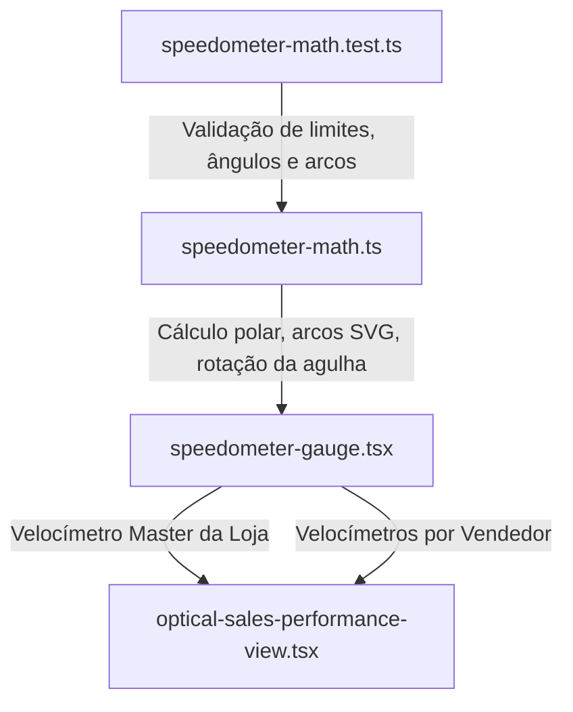

# Design Doc: Gráfico Velocímetro de Metas Estilo Power BI para MNOC-X CRM

**Data:** 17 de Setembro de 2026  
**Autor:** Antigravity AI Agent  
**Status:** Aprovado para Implementação  
**Escopo:** Módulo Óptico Commercial & Sales Performance (`optical-sales-performance-view.tsx`)

---

## 1. Visão Geral e Contexto

No módulo de vendas e performance do CRM MNOC-X, o acompanhamento de metas é atualmente representado por uma barra horizontal linear simples com um marcador de dias úteis. 

Para proporcionar uma experiência visual executiva de alto impacto — equivalente aos **dashboards analíticos do Power BI** e mostradores esportivos automotivos —, projetamos um componente de **Velocímetro Radial (Speedometer / Gauge Chart)**.

### Objetivos Principais
1. **Intuição Imediata de Ritmo (Pace)**: O usuário compreende instantaneamente se está "acelerando à frente da meta", "no ritmo ideal" ou "abaixo da velocidade necessária".
2. **Estilo Power BI Gauge**:
   - Arco semicircular de 180° com graduação e zonas de performance.
   - Linha de Alvo (*Target Marker*) destacando a **Meta Esperada Hoje** (proporcional ao tempo útil decorrido).
   - Agulha com ponteiro esportivo e pivô central de acabamento metálico/skeuomórfico no estilo Apple Minimalist.
   - Mostrador digital central estilo odômetro com valor realizado formatado em R$, percentual de atingimento e meta total.
3. **Visão Dupla**:
   - **Velocímetro Consolidado da Rede/Loja**: Mostrador principal no topo da seção de metas com métricas agregadas.
   - **Velocímetros Individuais dos Vendedores**: Mostrador compacto para cada vendedor, com toggle de alternância ("Velocímetro Power BI" vs "Barra Compacta").
4. **Engenharia de Alta Precisão**:
   - 100% SVG vetorial nativo (resolução infinita, sem bibliotecas pesadas de terceiros, sem layout shift).
   - Cálculos trigonométricos isolados em módulo puro (`speedometer-math.ts`) e testados via suite `bun test`.
   - Compatibilidade total com Dark Mode (`zinc-900`) e Light Mode (`white/silver`).
   - Acessibilidade ARIA (`role="meter"`, `aria-valuenow`, `aria-valuemin`, `aria-valuemax`).

---

## 2. Arquitetura de Componentes

### 2.1. Módulo Trigonométrico (`speedometer-math.ts`)
Responsável pelas equações geométricas do velocímetro:
- `polarToCartesian(cx, cy, r, angleInDegrees)`: Converte coordenadas angulares no plano cartesiano SVG.
- `describeArc(cx, cy, r, startAngle, endAngle)`: Gera comandos de caminho `M ... A ...` para desenhar os arcos do velocímetro.
- `valueToAngle(value, min, max, angleRange)`: Mapeia o valor financeiro ou percentual para o ângulo da agulha (de -180° a 0°).
- `calculatePaceStatus(realizado, esperadoHoje)`: Classifica em `AHEAD` (≥105%), `ON_TRACK` (95-104%) ou `BEHIND` (<95%).

### 2.2. Componente React (`speedometer-gauge.tsx`)
- **Props**:
  - `value`: Valor atual realizado (ex: `R$ 48.520`).
  - `max`: Meta máxima do período (ex: `R$ 55.000`).
  - `target`: Meta esperada hoje / Linha de Alvo do Power BI (ex: `R$ 42.100`).
  - `min`: Valor inicial (padrão `0`).
  - `title`: Título ou nome do vendedor.
  - `subtitle`: Subtítulo descritivo ou loja.
  - `size`: `"sm"` (cards de vendedor) ou `"lg"` (card master consolidado).
  - `animated`: Transição CSS suave da agulha (`duration-700 ease-out`).
  - `showTargetMarker`: Exibir ou ocultar a agulha/linha de target estilo Power BI.
  - `showTicks`: Graduações de escala (0%, 25%, 50%, 75%, 100%, 120%).

### 2.3. Integração em `optical-sales-performance-view.tsx`
- Adicionar Card Master com o velocímetro geral da equipe.
- Integrar nos cards individuais de vendedor com controle de visualização persistente.

---

## 3. Especificação Visual e Comportamento

### 3.1. Zonas do Velocímetro
- **Pista de Fundo (Track)**: Trilho semicircular cinza suave (`zinc-200` no light, `zinc-800` no dark).
- **Arco de Progresso Ativo**:
  - Vermelho Coral (`#ef4444`) se abaixo do ritmo (< 95%).
  - Azul Corporativo / Âmbar (`#3b82f6` / `#f59e0b`) se no ritmo previsto (95% - 104%).
  - Verde Esmeralda (`#10b981`) se acelerando acima do ritmo (≥ 105%).
- **Linha de Alvo Power BI (Target Needle / Marker)**:
  - Traço vertical de alto contraste na posição exata da meta esperada até a data atual, permitindo ao gestor ver se a agulha principal ultrapassou a linha de alvo.
- **Agulha Esportiva**:
  - Ponteiro estilizado com ponta afiada e contraste nítido.
  - Centro do pivô com gradiente radial e anel cromado estilo velocímetro de supercarro.

---

## 4. Plano de Validação e Testes
1. **Testes Unitários**:
   - `apps/app/app/(app)/[slug]/optical/components/__tests__/speedometer-math.test.ts`
   - Testar mapeamento de valores zerados, intermediários e acima de 100% (over-achievement até 150%).
   - Testar precisão de pontos cartesianos e sintaxe de paths SVG.
2. **Typecheck & Build**:
   - Executar `tsc --noEmit` no workspace `app`.
   - Executar `bun test` no monorepo.
3. **Validação Visual com `agent-browser`**:
   - Abrir a rota do CRM e capturar screenshots reais do velocímetro renderizado.
   - Validar responsividade e harmonia visual do velocímetro com o tema Apple Skeuomorph do MNOC-X.
