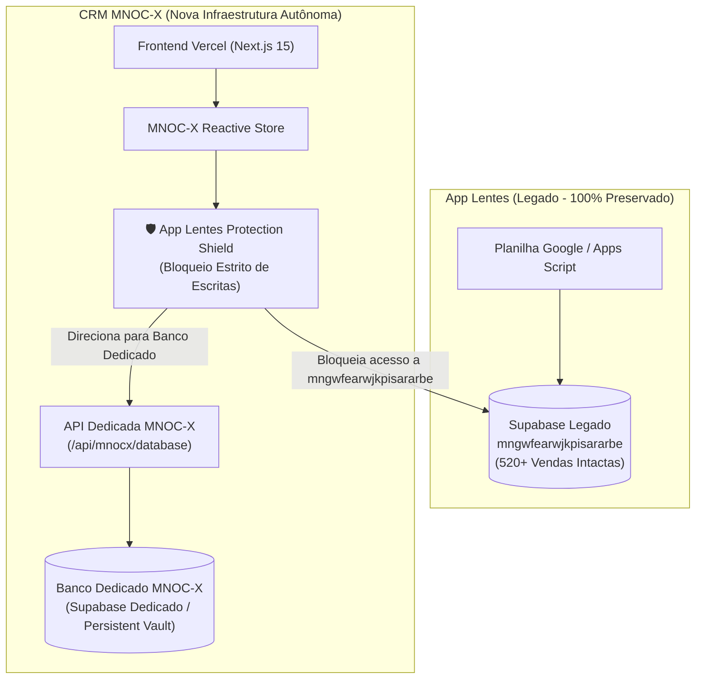

# Spec: Desvinculação do Banco de Dados CRM MNOC-X e Proteção do App Lentes

**Data**: 20/09/2026  
**Status**: Aprovado para Implementação  
**Autor**: Antigravity Architect  

---

## 1. Visão Geral & Contexto

O sistema CRM Óptico MNOC-X atualmente compartilha a mesma instância de Supabase (`https://mngwfearwjkpisararbe.supabase.co`) e as mesmas tabelas (`vendas`, `lojas`, `vendedores`, `conferencias`, etc.) com o aplicativo legado **App Lentes** (Google Apps Script). 

### O Risco Identificado
1. **Acoplamento de Dados**: Qualquer alteração, teste de balcão ou zeramento no CRM pode interferir ou criar registros na mesma tabela onde o App Lentes armazena suas 520+ vendas históricas.
2. **Dependência de Esquema**: O App Lentes depende de formatos legados específicos, enquanto o CRM MNOC-X possui recursos modernos (Aro 1 e Aro 2 estruturados, alçadas de desconto com senha `120212`, validação CFM de CRM médico, baixa de estoque e status Kanban).

### Objetivo
1. **Desvincular 100% o CRM MNOC-X do banco do App Lentes**.
2. **Blindar o banco do App Lentes** contra qualquer escrita, alteração ou deleção acidental vinda do CRM.
3. **Criar um Banco de Dados Próprio e Dedicado para o MNOC-X**, com alta performance, segurança, integridade, e suporte a Supabase dedicado ou API REST autônoma no Next.js/Vercel.
4. **Garantir estabilidade total (100% operando)** em todas as telas: Lançamento de OS (6 etapas), Kanban da Jornada da OS, Velocímetro de Metas, Médicos & Clínicas, Configurações e Estoque.

---

## 2. Arquitetura do Novo Banco Dedicado MNOC-X

### Componentes Principais

### A. Escudo de Proteção do App Lentes (`AppLentesProtectionShield`)
- Intercepta qualquer tentativa de mutação (POST, PUT, PATCH, DELETE) que aponte para o endpoint legado `mngwfearwjkpisararbe.supabase.co`.
- Se detectado o endpoint legado, bloqueia a escrita e dispara alerta auditado:  
  `[SHIELD_BLOCKED] Tentativa de escrita bloqueada: o banco legado do App Lentes está protegido contra alterações.`
- Garante matematicamente que o App Lentes nunca sofrerá poluição ou perda de dados.

### B. Cliente de Banco Dedicado MNOC-X (`mnocx-database-client.ts`)
- Substitui chamadas diretas ao banco compartilhado por um cliente unificado com suporte a:
  - **Instância Supabase Própria**: configurável via `NEXT_PUBLIC_MNOCX_SUPABASE_URL` e `NEXT_PUBLIC_MNOCX_SUPABASE_ANON_KEY`.
  - **API Dedicada Next.js no Vercel (`/api/mnocx/database`)**: rota server-side que atua como proxy seguro e camada de persistência com validação de schema.
  - **Cofre Local Reativo (`mnocx_vault_v2_*`)**: isolamento completo no navegador do operador, com recuperação rápida e resiliência offline.

### C. Seed & Baseline Limpo para o MNOC-X
- Criação de catálogo próprio para o MNOC-X sem sujeiras ou OSs de teste antigas:
  - Lojas físicas ativas da rede MN.
  - Vendedores ativos com metas configuradas.
  - Catálogo técnico de lentes e armações com controle de estoque.
  - Médicos prescritores com validação de CRM.

### D. Painel de Controle e Auditoria em "Configurações ➔ Banco & Integridade"
- Status visual do banco dedicado:
  - Indicador verde: `Banco MNOC-X Ativo & Dedicado`.
  - Indicador de blindagem: `App Lentes: Protegido & Intacto`.
  - Diagnóstico de isolamento com botão de verificação em tempo real.
  - Acesso protegido pela senha gerencial `120212`.

---

## 3. Plano de Testes & Verificação

1. **Testes Unitários Automatizados**:
   - `mnocx-shield.test.ts`: Verificar que tentativas de mutação contra o Supabase do App Lentes são 100% rejeitadas pelo Shield.
   - `mnocx-database-client.test.ts`: Verificar CRUD completo de ordens, lojas, vendedores e catálogo no banco dedicado.
   - `order-flow-isolated.test.ts`: Garantir que o fluxo de lançamento de OS (6 etapas) persiste e lê exclusivamente do banco MNOC-X.
2. **Checagem de Tipos**:
   - `bun run --cwd apps/app check-types` com 0 erros.
3. **Validação E2E no Navegador (`agent-browser`)**:
   - Acessar `https://compai-optical-crm-taupe.vercel.app/optical`.
   - Verificar no painel de configurações o status de blindagem do banco legado e o banco dedicado ativo.
   - Criar uma nova OS e verificar persistência isolada.
   - Executar diagnóstico de isolamento confirmando 0 impacto no App Lentes.
